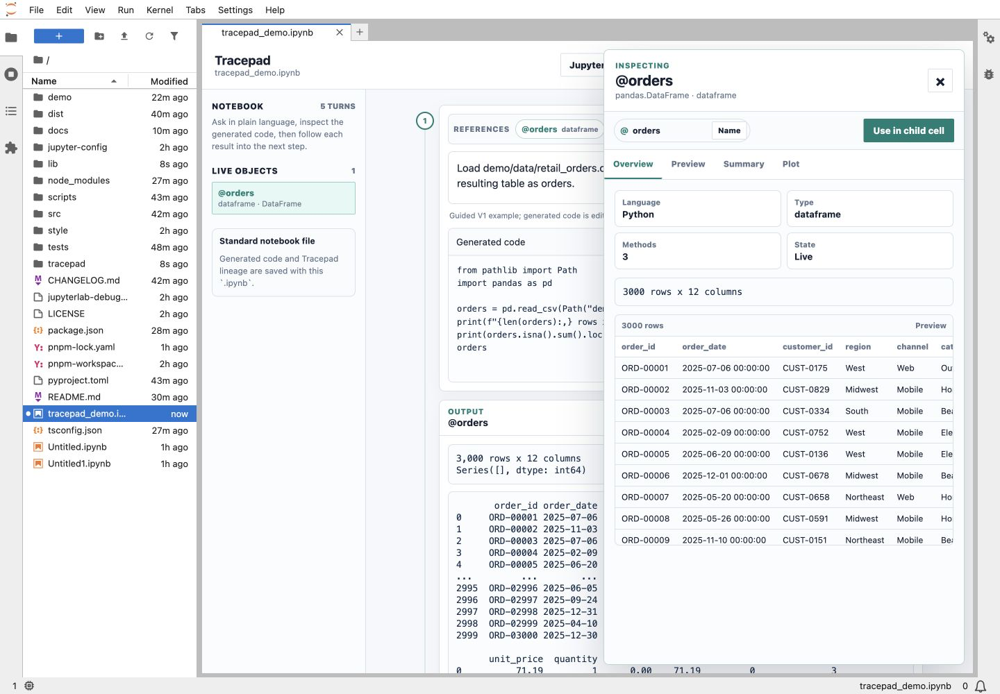
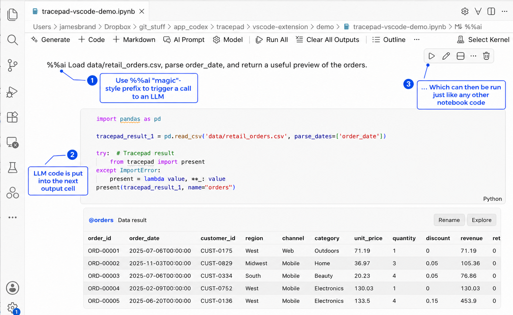
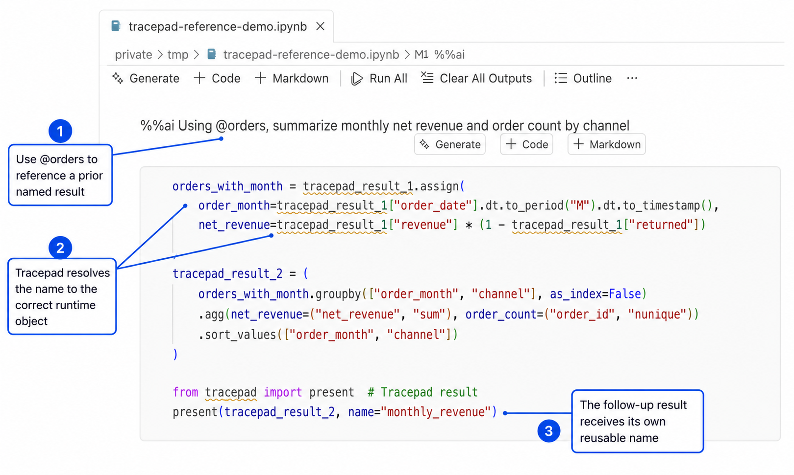
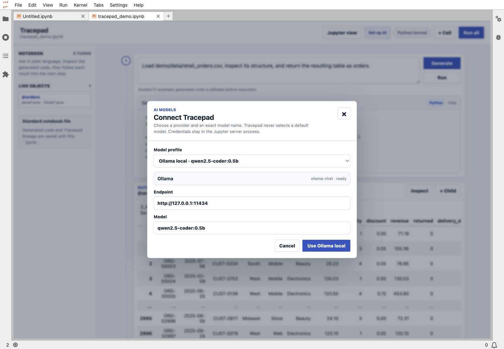

<p align="center">
  
</p>

# Tracepad

Tracepad adds an AI-first analysis flow to standard `.ipynb` notebooks:
plain-English request -> editable generated code -> native kernel output ->
inspection and follow-up. Result names such as `@orders` make dependencies
explicit and let Tracepad preserve lineage across the notebook.

> **Private pre-release.** Tracepad is installed from this repository. It is
> not published to PyPI or the VS Code Marketplace, and its interfaces may
> still change.

## Notebook hosts

| Host | Experience |
| --- | --- |
| JupyterLab | Full-page Tracepad notebook with inline inspection and lineage |
| VS Code | Native Markdown prompts, code cells, outputs, and Tracepad command chords |

Both hosts edit ordinary `.ipynb` files and use the notebook's real kernel.
Generated code remains visible to other notebook editors even when Tracepad is
not installed.



Tracepad currently provides its richest inspection for Python tables, plots,
and model-like objects. It can detect common methods such as `summary`,
coefficients, fitted values, prediction, and plotting. R, Julia, and SQL retain
their native notebook outputs while sharing the prompt and lineage workflow.

## Before installing

Tracepad is currently tested on macOS and Linux. The repository scripts use a
Unix shell and `.venv/bin`; native Windows installation is not yet documented
or tested. Python 3.9 or newer is required. The VS Code host additionally
requires VS Code 1.95 or newer, Node.js 22, and Corepack.

Choose one notebook host and one model provider before starting:

| Choice | Use it when |
| --- | --- |
| JupyterLab | You want Tracepad's full-page notebook, inspector, and lineage UI |
| VS Code | You want native VS Code Markdown, code cells, outputs, and commands |
| Ollama | A local Ollama server and model are already installed |
| OpenAI | You have an OpenAI API key and exact model name |
| OpenRouter | You have an OpenRouter key and exact provider/model id |

Tracepad never selects a default model. An installation agent can clone,
build, launch, and verify Tracepad, but it should not request, echo, or write an
API key. The user enters hosted-provider credentials through Tracepad's model
dialog or VS Code SecretStorage.

### Authenticate to the private repository

The most reliable agent-friendly path uses the GitHub CLI:

```bash
gh auth status
gh repo clone jamesbrandecon/tracepad
cd tracepad
```

SSH is also supported after `ssh -T git@github.com` succeeds:

```bash
git clone git@github.com:jamesbrandecon/tracepad.git
cd tracepad
```

## Install for JupyterLab

Prerequisites: authenticated repository access, Git, and Python 3.9 or newer.
Node and pnpm are not required because the prebuilt JupyterLab extension is
committed to the repository.

```bash
./scripts/install.sh
./scripts/demo.sh
```

`install.sh` chooses a supported Python, creates `.venv`, and installs the
package and demo dependencies. `demo.sh` is the canonical launch command and
opens `tracepad_demo.ipynb` in JupyterLab.

Verify the installation without starting another server:

```bash
.venv/bin/python -c "import tracepad; print('Tracepad', tracepad.__version__)"
.venv/bin/jupyter server extension list
.venv/bin/jupyter labextension list
```

Both extension lists should include Tracepad. Open an `.ipynb` with
**Tracepad Notebook** or use **Jupyter view** in the Tracepad header to switch
the same document back to the conventional editor.

## Install for VS Code

Prerequisites: authenticated repository access, Git, VS Code 1.95 or newer,
Node.js 22, Corepack, and a working Python/Jupyter kernel. Run these checks
before building:

```bash
code --version
node --version
corepack --version
```

Build and install the private VSIX without using the VS Code GUI:

```bash
corepack enable
pnpm install --frozen-lockfile
pnpm --dir vscode-extension run package
code --install-extension ms-toolsai.jupyter
code --install-extension vscode-extension/dist/tracepad-vscode.vsix --force
```

Verify both extensions are visible:

```bash
code --list-extensions --show-versions | grep -E 'ms-toolsai.jupyter|tracepad.tracepad-vscode'
```

Reload VS Code after installation. Open an `.ipynb`, select a working kernel,
and choose **AI Prompt** in the notebook toolbar or begin a Markdown cell with
`%%ai`.



Use the `Option/Alt+T` chord family:

| Chord | Action |
| --- | --- |
| `G` | Generate code |
| `R` | Generate and run |
| `N` | Generate, run, and add the next prompt |
| `P` | Add a prompt |
| `E` | Explore the selected result |
| `I` | Insert a prior `@result` reference |
| `L` | Show lineage |
| `A` | Rename the selected result |
| `M` | Select the model profile |

Generated code is collapsed by default but remains available through VS
Code's native cell expander. See
[`vscode-extension/README.md`](vscode-extension/README.md) for host-specific
details.

Named results can be reused in later English prompts. Tracepad records the
stable runtime mapping and lineage in notebook metadata while users work with
friendly names such as `@orders`.



## Configure an AI model

Tracepad includes Ollama, OpenAI, and OpenRouter adapters but does not choose a
provider or model. Generation remains disabled until an exact model is
selected. API keys are never stored in notebooks or YAML.

For a reproducible workspace configuration, create `tracepad.yaml` beside the
notebook. An installation agent may create this file after the user supplies
the provider and model name, but it must leave credentials out:

```yaml
version: 1
default_profile: analysis

profiles:
  analysis:
    provider: openai
    model: your-exact-model-name
```

Valid provider ids are `ollama`, `openai`, and `openrouter`. Ollama profiles
may also define a local endpoint; hosted providers still require a user-entered
key. Tracepad reads workspace `tracepad.yaml`,
`~/.config/tracepad/config.yaml`, or the path in `TRACEPAD_CONFIG`.

### JupyterLab model handoff

1. Start Tracepad with `./scripts/demo.sh`.
2. Select the model control in the Tracepad header.
3. Choose the configured profile or enter the exact provider and model.
4. The user enters the OpenAI or OpenRouter key when prompted.
5. For Ollama, confirm `ollama serve` is running and select a discovered model.

Values entered in JupyterLab live only in the Jupyter server process.



### VS Code model handoff

1. Run **Tracepad: Select Model** and choose the configured profile.
2. Run **Tracepad: Configure Provider Credentials**.
3. The user enters the hosted-provider key; VS Code stores it in
   SecretStorage rather than settings, YAML, or notebook metadata.
4. Run **Tracepad: Show Diagnostics** and confirm the selected provider and
   model are ready.

Environment variables remain supported for automated or headless setups:
`TRACEPAD_PROFILE`, `TRACEPAD_OPENAI_MODEL`, `TRACEPAD_OLLAMA_MODEL`,
`TRACEPAD_OPENROUTER_MODEL`, `OPENAI_API_KEY`, `OPENROUTER_API_KEY`, and
`OLLAMA_HOST`. A VS Code window launched from the macOS Dock may not inherit
shell variables, so YAML plus SecretStorage is the preferred desktop setup.

## Installation success criteria

An agent-assisted setup is complete when:

- the selected host reports the Tracepad extension as installed;
- the demo notebook opens with the expected Tracepad or native VS Code UI;
- a Python kernel containing `ipykernel` can execute an ordinary code cell;
- the selected provider and exact model report ready;
- a `%%ai` prompt generates editable code; and
- the user, not the agent, supplied any hosted-provider credential.

## Repository layout

| Path | Why it exists |
| --- | --- |
| `pyproject.toml` | Python package, Jupyter server extension, wheel contents, and Python dependencies |
| `package.json` / `tsconfig.json` | JupyterLab frontend package and TypeScript build |
| `pnpm-workspace.yaml` | Includes the VS Code package in the shared pnpm workspace and records native-build policy |
| `pnpm-lock.yaml` | Reproducible frontend and extension dependencies for local builds and CI |
| `jupyter-config/jupyter_server_config.d/tracepad.json` | Auto-enables Tracepad's authenticated server endpoints when the wheel is installed |
| `style/index.css` | JupyterLab's conventional stylesheet entrypoint and Tracepad UI rules |
| `tracepad/labextension/` | Prebuilt JupyterLab bundle used by repository and wheel installs |
| `vscode-extension/` | Native VS Code notebook host and VSIX package |

These files belong to separate packaging layers; none are interchangeable.

## Development

```bash
python3 -m venv .venv
.venv/bin/python -m pip install ".[dev,demo]"
pnpm install
PYTHON=.venv/bin/python pnpm build
pnpm test
pnpm --dir vscode-extension check
pnpm --dir vscode-extension test
.venv/bin/pytest -q
```

Build local artifacts without publishing them:

```bash
./scripts/build_wheel.sh
pnpm --dir vscode-extension run package
```

GitHub Actions runs the same builds and tests. Build artifacts under `dist/`
are ignored by Git and are not releases.

## Storage and security

- Prompts, generated code metadata, result names, and lineage are stored in
  standard notebook cells and `metadata.tracepad`.
- API keys stay in the Jupyter server process or VS Code SecretStorage.
- Generated code has the same authority as any code run in the active kernel;
  review it before execution.
- Ollama discovery runs from the Jupyter server or VS Code extension host. On a
  remote machine, `127.0.0.1` refers to that remote machine.
- Do not disable Jupyter authentication on shared or network-accessible hosts.
