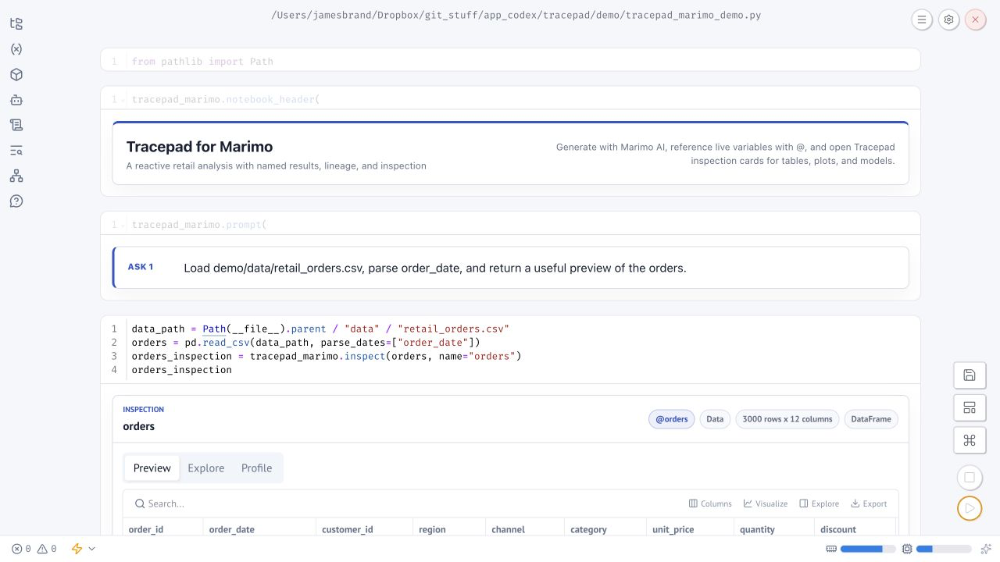

<p align="center">
  
</p>

> **Alpha software:** Tracepad is an early experiment with substantially
> LLM-generated code. Review generated code and use it at your own risk.

# Tracepad
Tracepad is my LLM-assisted attempt to improve the AI flow in `.ipynb`
notebooks. It addresses two problems with current AI workflows:

1. **Untracked user intent:** After a request is made to an LLM (for example,
   inline or in a chat sidebar) and code is generated, the original request is
   often lost.

2. **Code bloat:** LLMs quickly add long sequences of code that are difficult
   to review. This is exacerbated by the loss of user intent across multiple
   turns.

Tracepad adds dedicated AI prompt cells and named outputs that preserve the
analysis path through a notebook. The resulting flow is:

`natural language request -> editable generated code -> native kernel output -> follow-up by name`

## Notebook hosts
Tracepad implements this workflow in three notebook interfaces:

| Host | Experience |
| --- | --- |
| JupyterLab | Full-page Tracepad notebook with inline inspection and lineage |
| VS Code | Native Markdown prompts, code cells, outputs, and Tracepad command chords |
| Marimo | Native reactive Python cells with AI generation, `@variable` context, and inline Tracepad inspection |

JupyterLab and VS Code edit ordinary `.ipynb` files and use the notebook's kernel. Generated
code therefore remains visible in other notebook editors even when Tracepad is
not installed. After submission, prompt cells become ordinary Markdown. The
JupyterLab interface below shows a prompt, generated code, named results, and
the evolving inspection pane.

Marimo stores notebooks as ordinary Python files and executes them as a
reactive dependency graph. Tracepad uses Marimo's native AI generation instead
of emulating an `.ipynb` prompt cell: English requests remain visible as prompt
cards, generated code is a normal editable Marimo cell, and named Python
variables are the reusable results.


Tracepad currently provides its richest inspection for Python tables, plots,
and model-like objects. It detects common methods such as `summary`,
coefficients, fitted values, prediction, and plotting, then uses them for basic
summaries in the inspection pane.

## Before installing

Tracepad supports current macOS, Linux, and Windows releases. Python 3.9 or
newer is required. The VS Code host additionally requires VS Code 1.95 or
newer, Node.js 22, and either pnpm or Corepack. Bash and PowerShell wrappers
call the same cross-platform Python installers.

Choose one notebook host and one model provider before starting:

| Choice | Use it when |
| --- | --- |
| JupyterLab | You want Tracepad's full-page notebook, inspector, and lineage UI |
| VS Code | You want native VS Code Markdown, code cells, outputs, and commands |
| Marimo | You want reactive execution, native variable references, and a Python-file notebook |

Model providers include OpenAI, OpenRouter, and local Ollama models. JupyterLab
and VS Code provide Tracepad setup flows; Marimo uses its native AI provider
settings.

### Clone the repository

```bash
git clone https://github.com/jamesbrandecon/tracepad.git
cd tracepad
```

## Install for JupyterLab

Prerequisites: Git and Python 3.9 or newer.

**macOS or Linux:**

```bash
./scripts/install.sh
./scripts/demo.sh
```

**Windows PowerShell:**

```powershell
.\scripts\install.ps1
.\scripts\demo.ps1
```

If local PowerShell policy blocks repository scripts, first run
`Set-ExecutionPolicy -Scope Process Bypass`. Both installers create `.venv`
and install Tracepad plus the demo dependencies. Both demo commands open
`tracepad_demo.ipynb` in JupyterLab.

The bundled `.ipynb` demos contain prompts only. Generate and run them from top to
bottom to create the code, outputs, named results, and lineage yourself.

Verify the installation without starting another server:

```bash
python3 scripts/verify_install.py       # macOS/Linux
py -3 .\scripts\verify_install.py       # Windows PowerShell
```

The verifier checks the installed Python package, authenticated server
extension, prebuilt JupyterLab extension, and registered Tracepad kernel. Open an `.ipynb` with
**Tracepad Notebook** or use **Jupyter view** in the Tracepad header to switch
the same document back to the conventional editor.

## Install for Marimo

Prerequisites: Git, [uv](https://docs.astral.sh/uv/), and Python 3.10 or newer.
From the cloned repository:

```bash
uv venv --python 3.12
uv pip install ".[demo,marimo]"
uv run --no-sync marimo edit demo/tracepad_marimo_demo.py
```

The same commands work in Windows PowerShell. Marimo opens the demo as a
reactive Python notebook containing prompts but no prewritten analysis. Work
from top to bottom: click **Generate** on a Tracepad Ask, review the code Marimo
places in the native cell immediately below it, then run that cell before
continuing. You do not need to retype or paste the displayed Ask.

Configure an **Edit model** in Marimo's **Settings > AI** before generating.
Marimo supports hosted providers, OpenRouter, Ollama, and custom
OpenAI-compatible endpoints; Tracepad does not select a provider or model.
The Tracepad button opens Marimo's native AI edit flow, supplies the saved Ask,
and leaves Marimo's review and acceptance controls intact. Repository rules in
`pyproject.toml` ask the model to create one concise executable cell, reuse live
variables named with `@`, preserve fitted models, and finish with an appropriate
Tracepad inspection card.

Marimo references are native Python variables. A prompt such as `Using
@monthly_revenue, plot net revenue over time` lets Marimo attach that live
value as AI context. The **Variables** and **Dependencies** panels show the
reactive graph, while `tracepad.marimo.inspect(...)` adds Preview, Explore,
Profile, Coefficients, Predictions, and Diagnostics tabs appropriate to the
returned object.

The screenshot below shows the demo after generating and running its first
prompt; the repository copy opens without generated code or results.



## Install for VS Code

Prerequisites: Git, VS Code 1.95 or newer, Node.js 22, Corepack, and a working
Python/Jupyter kernel. Run these checks
before building:

```bash
code --version
node --version
corepack --version
```

Build and install the VSIX without using the VS Code GUI.

macOS or Linux:

```bash
./scripts/install_vscode.sh
```

Windows PowerShell:

```powershell
.\scripts\install_vscode.ps1
```

The installer resolves pnpm or Corepack, builds the locked VSIX, installs the
Microsoft Jupyter dependency, creates `.venv`, installs the Python package and
demo dependencies, and registers a project-local kernel. Reload VS Code, open
an `.ipynb`, and select
**Tracepad (.venv)** from the kernel picker. If VS Code lists only interpreter
paths, choose the one ending in `.venv/bin/python` on macOS/Linux or
`.venv\Scripts\python.exe` on Windows.

## Usage
Choose **Model** once to select a provider, exact model, and any required
credential. Then choose **AI Prompt** or begin a Markdown cell with `%%ai`.

With a Tracepad prompt selected, **Generate with Tracepad** runs the same action
as `Option/Alt+T`, then `G`: it sends the existing Markdown request to the
configured provider and creates or updates its paired code cell. VS Code or
GitHub Copilot may separately contribute a generic **Generate** action that
opens an inline prompt; that is not a Tracepad control.


Use the `Option/Alt+T` chord family:

| Chord | Action |
| --- | --- |
| `G` | Generate code |
| `R` | Generate and run |
| `N` | Generate, run, and add the next prompt |
| `P` | Add a prompt prefilled with `%%ai` |
| `E` | Create a follow-up from the selected result |
| `I` | Insert a prior `@result` reference |
| `L` | Show lineage |
| `A` | Rename the selected result |
| `M` | Set up or change the model |

Generated code is collapsed by default but remains available through VS
Code's native cell expander. See
[`vscode-extension/README.md`](vscode-extension/README.md) for host-specific
details.

Named results can be reused in later English prompts. Tracepad records a stable
runtime mapping and lineage in notebook metadata while users work with names
such as `@orders`. Generated code shows `orders = tracepad_result_1` explicitly;
this creates another reference to the same object and does not copy the data.
Result cards keep **Follow-up** (create an AI child turn) separate from
**Lineage** (navigate inputs and derived results).


## Configure an AI model

Tracepad includes Ollama, OpenAI, and OpenRouter adapters but does not choose a
provider or model. Generation remains disabled until the user selects an exact
model. API keys are never stored in notebooks, settings, or YAML.

For a first run, use the **Model** control in JupyterLab or VS Code, or
**Settings > AI** in Marimo. Hosted providers ask for an exact model. Tracepad
stores a key only in the current Jupyter server process or VS Code
SecretStorage; Marimo manages its own provider credentials. Ollama discovers
models from the local server and also permits manual model entry.

For shared parameters or multiple reusable profiles, optionally create
`tracepad.yaml` beside the notebook. An installation agent may create this
file after the user supplies the provider and model name, but it must leave
credentials out:

```yaml
version: 1
default_profile: analysis

profiles:
  analysis:
    provider: openai
    model: your-exact-model-name
```

Valid provider ids are `ollama`, `openai`, and `openrouter`. Ollama profiles
may also define a local endpoint; hosted providers still require a user-entered
key. Tracepad reads workspace `tracepad.yaml`, the user configuration at
`~/.config/tracepad/config.yaml` on macOS/Linux or
`%APPDATA%\tracepad\config.yaml` on Windows, or the path in
`TRACEPAD_CONFIG`.

### JupyterLab model handoff

1. Start Tracepad with `./scripts/demo.sh` or `.\scripts\demo.ps1`.
2. Select **Model** in the Tracepad header.
3. Choose the provider profile and exact model.
4. The user enters the OpenAI or OpenRouter key when prompted.
5. For Ollama, confirm `ollama serve` is running and select a discovered model.

Values entered in JupyterLab live only in the Jupyter server process.


### Marimo model handoff

1. Start the demo with `uv run --no-sync marimo edit demo/tracepad_marimo_demo.py`.
2. Open **Settings > AI** in Marimo.
3. Choose and configure an exact **Edit model**.
   For a local Ollama model not shown in Marimo's built-in catalog, add its
   qualified id, such as `ollama/qwen2.5-coder:0.5b`, as a custom model. Use
   `http://127.0.0.1:11434/v1` as the Ollama base URL; Marimo calls Ollama's
   OpenAI-compatible API.
4. Click **Generate** on a Tracepad Ask. Tracepad sends that Ask to Marimo's AI
   editor for the native cell immediately below it.
5. Review the generated code, accept it, and run the cell normally.

Tracepad contributes project-level generation rules but delegates provider
credentials and request transport to Marimo. Do not put credentials in the
notebook, prompt text, or `pyproject.toml`.

### VS Code model handoff

1. Choose **Model** in the notebook toolbar or run **Tracepad: Set Up Model**.
2. Choose a provider profile and enter or select the exact model.
3. The user enters a hosted-provider key when prompted; VS Code stores it in
   SecretStorage rather than settings, YAML, or notebook metadata.
4. Run **Tracepad: Show Diagnostics** and confirm `Ready: true`.

VS Code remembers non-secret model choices per profile in the workspace or
user settings. `tracepad.yaml` remains the better choice when a team needs
named profiles with shared generation parameters.

Environment variables remain supported for automated or headless setups:
`TRACEPAD_PROFILE`, `TRACEPAD_OPENAI_MODEL`, `TRACEPAD_OLLAMA_MODEL`,
`TRACEPAD_OPENROUTER_MODEL`, `OPENAI_API_KEY`, `OPENROUTER_API_KEY`, and
`OLLAMA_HOST`. A VS Code window launched from the macOS Dock may not inherit
shell variables, so VS Code settings or YAML plus SecretStorage is the
preferred desktop setup.

## What Tracepad sends to the AI

Tracepad sends a system instruction, the user's English request, the current
kernel language, source from the notebook's other code cells, and the
host-specific tracking context described below. Cell outputs are not included.
The response must be JSON with a complete `code` string and optional `notes`;
Tracepad then places the code in an editable notebook cell.

The JupyterLab request has this shape:

```text
System: Generate concise, executable notebook code. Return JSON containing
code and notes, use the supplied kernel language, use supplied notebook
variables and references, and leave the most useful table, plot, or fitted
model as the final expression. Do not embed, print, or request secrets.

Kernel language: <language>
Prior notebook context (reference material only): <context JSON>
Active user request (answer only this): <English request>
```

JupyterLab context contains source from every other non-empty code cell, the
names of notebook variables, metadata for explicitly referenced results, and
parent-result metadata when creating a follow-up. It also supplies the planned
result name so generated code can assign and return the object that Tracepad
will register. Reference metadata includes the result name, type, language,
classes, capabilities, and column names. It does not include result rows,
previews, summaries, or cell outputs.

The native VS Code request uses a stricter result-binding contract:

```text
System: Generate concise executable code in <kernel language>, return JSON
containing code and notes, and bind the primary reusable result to
<stable runtime name>. Do not embed, print, or request secrets.

Prior notebook code (source only; cell outputs are excluded): <code-cell JSON>
Available Tracepad references: <reference JSON>
Active user request (answer only this): <English request>
```

VS Code also sends source from every other non-empty code cell. It separately
identifies prior results explicitly named in the request, plus a parent result
for a follow-up. Each selected reference includes its display name, stable
runtime name, turn number, and up to 4,000 characters of the source code that
created it. Saved outputs, table rows, and table previews are not included.

Both system prompts include Tracepad's backend and tracking contract: how
friendly `@name` references map to stable runtime objects, which object must be
left available for reuse, and how to preserve inspectable tables, plots, and
models. Tracepad itself adds display, registration, and lineage handling after
generation, so the model only needs the result-binding and reference contract.

**Fix with AI** additionally sends the original request, current generated
code, and the kernel error. API keys are transport credentials and are not
placed in the prompt, notebook, or YAML. Tracepad sets `store: false` on
OpenAI-compatible hosted request payloads and applies best-effort redaction for
common keys, tokens, passwords, credential URLs, and private keys found in
prompts or notebook source. Redaction is not a security boundary: code and
prompts can still contain sensitive literals, paths, comments, or data, so
review them before using a hosted provider. Ollama requests remain on the
configured Ollama endpoint; OpenAI and OpenRouter requests are sent to those
hosted services, whose retention policies still apply.

The exact prompt builders are maintained in
[`src/tracepad/server.py`](src/tracepad/server.py) and
[`vscode-extension/src/providerClient.ts`](vscode-extension/src/providerClient.ts).

Marimo generation is intentionally different: Marimo constructs and sends the
AI request itself. Tracepad's `[tool.marimo.ai]` rules add only the result,
reference, and inspection contract. Marimo decides how notebook code and live
`@variable` values are supplied to the configured provider.

## Installation success criteria

An agent-assisted setup is complete when:

- the selected host opens its demo with the expected Tracepad interface;
- its Python runtime can execute an ordinary code cell;
- the selected provider and exact model report ready;
- a Tracepad prompt or Marimo AI request generates editable code; and
- the user, not the agent, supplied any hosted-provider credential.

## Report an alpha issue

Open a GitHub bug report and include the smallest reproducible notebook or a
screenshot using synthetic data. In VS Code, run **Tracepad: Show
Diagnostics** and paste its output. In JupyterLab, include the model status and
relevant server log lines. Diagnostics omit API key values, but review local
paths and notebook content before posting.

## Repository layout

| Path | Why it exists |
| --- | --- |
| `pyproject.toml` | Python package, Jupyter server extension, wheel contents, and Python dependencies |
| `package.json` / `tsconfig.json` | JupyterLab frontend package and TypeScript build |
| `pnpm-workspace.yaml` | Includes the VS Code package in the shared pnpm workspace and records native-build policy |
| `pnpm-lock.yaml` | Reproducible frontend and extension dependencies for local builds and CI |
| `jupyter-config/jupyter_server_config.d/tracepad.json` | Auto-enables Tracepad's authenticated server endpoints when the wheel is installed |
| `style/index.css` | JupyterLab's conventional stylesheet entrypoint and Tracepad UI rules |
| `tracepad/labextension/` | Prebuilt JupyterLab bundle used by repository and wheel installs |
| `vscode-extension/` | Native VS Code notebook host and VSIX package |
| `src/tracepad/marimo.py` | Marimo-native prompts, inspection, model diagnostics, and lineage helpers |
| `demo/tracepad_marimo_demo.py` | Reactive Marimo demo using the synthetic retail data |
| `style/marimo.css` | Notebook-scoped cobalt styling loaded by the bundled Marimo demo |
| `scripts/*.py` with `.sh`/`.ps1` wrappers | Cross-platform installation, launch, verification, and packaging |

These files belong to separate packaging layers; none are interchangeable.

## Development

macOS or Linux:

```bash
python3 -m venv .venv
.venv/bin/python -m pip install ".[dev,demo,marimo]"
pnpm install
PYTHON=.venv/bin/python pnpm build
pnpm test
pnpm --dir vscode-extension check
pnpm --dir vscode-extension test
.venv/bin/pytest -q
.venv/bin/python -m marimo check demo/tracepad_marimo_demo.py
```

Build local artifacts without publishing them:

```bash
./scripts/build_wheel.sh
pnpm --dir vscode-extension run package
```

On Windows PowerShell, use `.venv\Scripts\python.exe` in place of
`.venv/bin/python`, set `$env:PYTHON = ".venv\Scripts\python.exe"` before
`pnpm build`, and run `.\scripts\build_wheel.ps1` for the wheel. The pnpm
commands themselves are identical across platforms.

GitHub Actions runs builds, tests, executable notebook checks, native installer
smokes, wheel builds, and VSIX packaging on `ubuntu-latest`, `macos-latest`,
and `windows-latest`. Build artifacts under `dist/` are ignored by Git and are
not releases.

## Storage and security

- Prompts, generated code metadata, result names, and lineage are stored in
  standard notebook cells and `metadata.tracepad` for `.ipynb` hosts. Marimo
  stores prompts, code, variables, and dependencies in its ordinary Python
  notebook source and reactive graph.
- API keys stay in the Jupyter server process, VS Code SecretStorage, or the
  configured Marimo provider store; they are not written by Tracepad.
- Generated code has the same authority as any code run in the active kernel;
  review it before execution.
- Ollama discovery runs from the Jupyter server, VS Code extension host, or
  Marimo process. On a remote machine, `127.0.0.1` refers to that remote
  machine.
- Do not disable Jupyter authentication on shared or network-accessible hosts.
