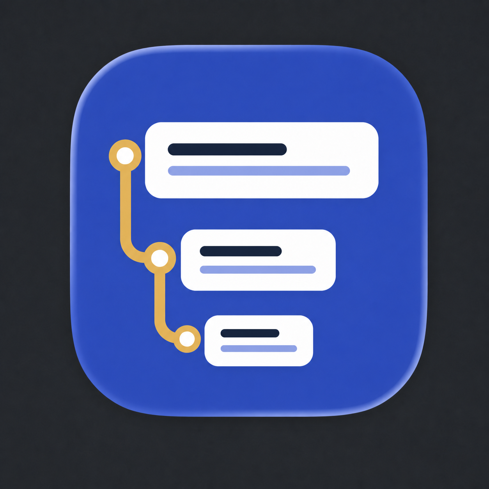

<p align="center">
  
</p>

# Tracepad for VS Code

Tracepad adds AI-first analysis turns to VS Code's native Jupyter notebook
editor. It does not replace the notebook renderer, code editor, kernel, or
output system.

Each turn is stored as two ordinary `.ipynb` cells:

1. A Markdown cell containing the English request.
2. A code cell containing editable AI-generated code and normal Jupyter output.

Tracepad metadata connects the pair, gives results stable runtime names, and
records child lineage. Editors without Tracepad still display a valid notebook.

## Install from this repository

macOS or Linux:

```bash
./scripts/install_vscode.sh
```

Windows PowerShell:

```powershell
.\scripts\install_vscode.ps1
```

Run these commands from the repository root. The installer builds the private
VSIX and installs both it and the required Microsoft Jupyter extension. Reload
VS Code afterward.

For extension development, open `vscode-extension/` in VS Code and press `F5`
after running:

```bash
pnpm install
pnpm --dir vscode-extension build
```

## Configure AI

Tracepad provides Ollama, OpenAI, and OpenRouter adapters but does not choose a
default model. For a first run, choose **Model** in the notebook toolbar or run
**Tracepad: Set Up Model**. Choose a provider profile, enter or select the
exact model, and provide a hosted key when prompted. VS Code stores model names
in settings and keys in SecretStorage.

For multiple shared profiles or generation parameters, optionally put the
provider and exact model name in workspace `tracepad.yaml` without including
an API key:

```yaml
version: 1
default_profile: analysis

profiles:
  analysis:
    provider: openai
    model: your-exact-model-name
```

Run **Tracepad: Select Model** to switch among profiles already configured in
YAML or settings. Keys are never written to YAML, VS Code settings, or notebook
metadata. Ollama requires a running local server and installed model but no
key. The active provider and model are visible in the status bar.

When VS Code was launched from the macOS Dock and does not inherit shell
environment variables, SecretStorage remains reliable. Environment variables
are supported for headless setups; see the root README for their names. Run
**Tracepad: Show Diagnostics** to inspect configuration discovery and provider
readiness without exposing credential values.

Generation sends the English request and source code for the small, adaptive
set of referenced cells to the selected provider. It does not send saved cell
outputs or table previews automatically.

## Use it

1. Open a Python, R, Julia, or SQL `.ipynb` with a working Jupyter kernel. For
   the repository demo, select **Tracepad (.venv)**. If VS Code shows only
   paths, select the interpreter ending in `.venv/bin/python` on macOS/Linux
   or `.venv\Scripts\python.exe` on Windows.
2. Select **AI Prompt** in the notebook toolbar, or start any Markdown cell
   with `%%ai`. Write ordinary English beneath the marker. Tracepad does not
   pre-create an empty code cell.
3. Type `@` to see earlier named results, their turn numbers, result kinds, and
   whether they need to be run. Both `@orders` and its numeric turn reference
   (for example `@1`) resolve to the same stable kernel object. Generated code
   shows the friendly-to-stable binding, such as
   `orders = tracepad_result_1`; this does not copy the object.
4. Choose **Generate with Tracepad**, or press `Option+T`, then `G` (`Alt+T`,
   then `G` on Windows/Linux), to generate code without running it. Both invoke
   the same command on the current prompt. VS Code or GitHub Copilot may also
   show a generic **Generate** action that opens its own inline prompt; that is
   not a Tracepad control. After generation,
   Tracepad removes `%%ai`, leaves a plain portable Markdown request, and
   inserts or updates exactly one paired code cell below it.
5. Review or edit the code and use VS Code's normal Run control, or press
   `Option+T`, then `R` on the prompt to generate and run in one action. After
   generation, the generated code is collapsed so the request and result
   remain primary; use the native cell expander to inspect it. Set
   `tracepad.collapseGeneratedCode` to `false` to keep generated code open.
6. Select `@result_name` or press `Option/Alt+T`, then `A`, with its cell
   selected to assign a friendly alias.
7. After a successful output appears, select **Follow-up**. Tables, models, and
   plots receive different actions; each creates and generates a visibly
   linked child turn beneath the result. Select **Lineage** to navigate inputs
   and downstream results without creating a cell.
8. Use `Option+T`, then `N` on a prompt to generate, run, and insert the next `%%ai`
   prompt. If execution fails, **Fix with AI** appears only on that failed
   result. It updates the paired code cell and asks you to run it again.

Regeneration is idempotent: it updates the code cell already paired with the
prompt instead of inserting duplicates. If you edited generated code manually,
Tracepad asks before replacing it. Editing a prompt after generation marks its
code as stale. Generation requests can be cancelled from VS Code's progress UI.

### Keyboard flow

Press `Option+T` on macOS or `Alt+T` on Windows/Linux, release it, then press:

| Second key | Action |
| --- | --- |
| `G` | Generate code |
| `R` | Generate and run |
| `N` | Generate, run, and add the next prompt |
| `P` | Add a new AI prompt prefilled with `%%ai` |
| `E` | Create a follow-up from the selected result |
| `I` | Insert a prior result reference |
| `L` | Show result lineage |
| `A` | Rename the selected result alias |
| `M` | Set up or change the model |

Tracepad uses a dedicated chord family and does not override Jupyter's normal
execution or editing keys. Commands still validate the selected prompt or
result before acting, and users can override extension defaults in Keyboard
Shortcuts normally.

Typing `@` in a Tracepad prompt opens VS Code's suggestion list with prior
named results. If the host suppresses automatic Markdown suggestions, use
`Option/Alt+T`, then `I`, or select **Reference** on the prompt status bar to
open the same choices explicitly.

Generated metadata records the exact upstream result turns. Prompt status bars
show their inputs, result status bars show downstream use counts, and selecting
either opens a native quick pick that jumps to the connected cell. The notebook
still consists only of Markdown cells, code cells, outputs, and ignorable
metadata when Tracepad is not installed.

Python kernels with the Tracepad wheel installed render data frames, Matplotlib
figures, and model-like objects through a compact custom MIME renderer. The
renderer shows table previews, plot images, coefficients, summaries, and
available methods without changing the underlying object. A kernel without the
runtime helper still runs generated code and falls back to ordinary Jupyter
output.

Open `demo/tracepad-vscode-demo.ipynb` from the repository root for an example.
It reads its bundled `demo/data/retail_orders.csv` and
shows a source table, a named aggregation, and a child visualization.

Select a Python kernel that contains `ipykernel`; repository installs can use
`.venv/bin/python` on macOS/Linux or `.venv\Scripts\python.exe` on Windows.
The demo bundles its CSV beside the notebook so execution does not depend on
the VS Code workspace's working directory.

## V1 boundaries

- VS Code owns code editing, execution, keyboard behavior, output MIME
  rendering, and notebook persistence.
- The `Option/Alt+T` chord family exposes Tracepad actions without changing
  Jupyter's native `Ctrl+Enter`, `Shift+Enter`, or `Alt+Enter` behavior.
- Follow-up is an inline child turn, not a sidebar or custom webview; Lineage
  is navigation only.
- Result names are friendly prompt references bound visibly to stable kernel
  variables such as `tracepad_result_2_1`; the binding does not copy data.
- Kernel objects disappear when the kernel restarts. Re-run ancestor cells to
  recreate them.
- Rich Tracepad cards currently target Python objects. R, Julia, and SQL keep
  their native Jupyter outputs while sharing prompt, model, and lineage UX.
